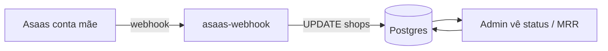
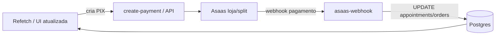

# Fluxo Asaas → webhook → banco → app

Visão geral de como o sistema reage aos eventos do Asaas após as mudanças de mensalidade da plataforma e webhook.

## Actores

| Actor | Papel |
|--------|--------|
| **Asaas (conta mãe)** | Cobranças da **mensalidade da plataforma** por estabelecimento (assinatura). |
| **Asaas (conta da loja / split)** | Cobranças de **agendamento** e **pedidos** (PIX) dos clientes. |
| **Edge Function `asaas-webhook`** | Recebe webhooks, idempotência, atualiza BD. |
| **Supabase (Postgres)** | `shops`, `appointments`, `orders`, tabelas de dedupe de webhook. |
| **Admin (portal)** | Edita `asaas_platform_subscription_id`, mensalidade, split, etc. |
| **Cliente (ShopDetails)** | Paga PIX; estado reflete após confirmação via webhook. |

## Fluxo A — Mensalidade da plataforma (assinatura na conta mãe)

1. No **Admin**, cola-se o **ID da assinatura** Asaas da conta mãe no campo da loja (`asaas_platform_subscription_id`).
2. O Asaas envia eventos para a URL da função **`asaas-webhook`** (configurada no painel Asaas).
3. A função:
   - regista eventos sensíveis em tabelas de **receipt** (evita processar duas vezes o mesmo evento);
   - em eventos de **inativação/remoção** de assinatura, marca `shops.subscription_active = false` onde o ID bate com o guardado;
   - em **pagamento recebido/confirmado**, pode fazer **GET** do pagamento na API Asaas (**chave + URL do mesmo ambiente** que validou o token do webhook — sandbox vs produção) e, se o pagamento estiver ligado à assinatura certa, marca `subscription_active = true` na loja correspondente.
4. **Quem vê o quê:** métricas e lista no **Admin** (ex.: assinaturas ativas, MRR estimado) passam a refletir melhor o estado real quando o webhook e o ID estão corretos.

## Fluxo B — Pagamento de cliente (agendamento ou loja)

1. Cliente inicia pagamento; a app chama a API de criação de pagamento (ex. Edge Function `create-payment` ou fluxo equivalente).
2. Asaas gera cobrança PIX; o cliente paga.
3. Webhook **`PAYMENT_RECEIVED` / `PAYMENT_CONFIRMED`** chega em **`asaas-webhook`**.
4. A função deduplica, identifica o pagamento (ex. `externalReference`, `asaas_payment_id`) e marca **`appointments`** ou **`orders`** como pagos, conforme a lógica já existente.
5. **`PAYMENT_DELETED`** (e variantes `PAYMENT_REMOVED`, etc.): cobrança apagada no Asaas → para linhas ainda **`PENDING`**, limpa `asaas_payment_id` e `payment_idempotency_key` (agendamento ou pedido), para o cliente poder gerar um novo PIX. Resposta **200**.
6. **Outros eventos** (`PAYMENT_CREATED`, `PAYMENT_UPDATED`, …): lista `IGNORE_EVENTS` → **200** com `{ ignored: true }`, sem lógica extra. O nome do evento é normalizado em maiúsculas.
7. Qualquer **exceção não prevista** no handler → **200** + `note` nos logs (`fatal_outer_catch` na camada mais externa), para não pausar a fila do Asaas.
8. **Nenhum secret de webhook configurado** (`ASAAS_WEBHOOK_TOKEN` nem `ASAAS_WEBHOOK_TOKEN_SANDBOX`) → **200** + `note: ASAAS_WEBHOOK_TOKEN not configured` (não processa; não penaliza a fila).
9. **Cliente:** em `ShopDetails`, o fluxo é **PIX pendente** → link → “já paguei” / refetch; o que importa é confirmação e estado na BD.

## Autenticação do webhook (sandbox vs produção)

- O Asaas envia o token no header **`asaas-access-token`** (ou `Authorization: Bearer …`).
- No Supabase (Secrets da Edge), defines **`ASAAS_WEBHOOK_TOKEN`** (produção) e/ou **`ASAAS_WEBHOOK_TOKEN_SANDBOX`** (homologação). O código valida com **comparação em tempo constante** e escolhe o par **API key + base URL** do ambiente cujo token bateu (`resolveWebhookRuntime` em `asaas-webhook/index.ts`). Se o `User-Agent` sugerir sandbox (`hmlg` / `sandbox`), tenta o token sandbox **antes** do de produção.
- O **toggle** “Produção / Sandbox” do admin (`platform_runtime_settings`) afeta o **`create-payment`** (qual API chamar ao gerar PIX). **Não** substitui a lógica acima: um webhook de homologação pode chegar mesmo com o toggle em produção, desde que o token sandbox esteja correto.

Guia de variáveis: **[SECRETS_AND_KEYS.md](../SECRETS_AND_KEYS.md)**.

## Mapeamento evento → efeito (resumo)

| Evento (normalizado) | Efeito principal |
|----------------------|------------------|
| `PAYMENT_RECEIVED`, `PAYMENT_CONFIRMED` | Dedupe em `asaas_webhook_receipts`; `appointments` / `orders` com esse `asaas_payment_id` → `PAID`; se não atualizar nada, GET no Asaas e reconciliação por `externalReference` (`booking:` / `order:` + idempotency); se o pagamento tiver `subscription`, `shops` com `asaas_platform_subscription_id` igual → `subscription_active = true` |
| `SUBSCRIPTION_INACTIVATED`, `SUBSCRIPTION_DELETED` | Dedupe em `asaas_subscription_webhook_receipts`; `shops` com esse id de assinatura → `subscription_active = false` |
| `PAYMENT_DELETED`, `PAYMENT_REMOVED`, … | Em `PENDING`, limpa `asaas_payment_id` e `payment_idempotency_key` em `appointments` / `orders` |
| `PAYMENT_CREATED`, `PAYMENT_UPDATED`, `PAYMENT_OVERDUE`, `PAYMENT_REFUNDED`, … | **200** + `ignored: true` (sem alterar BD) |
| Outros / sem `payment.id` nos confirmados | **200** + `received: true` (sem lógica de pagamento) |

## Configuração mínima para funcionar bem

- **URL** do webhook no Asaas (produção e, se usares, sandbox) apontando para `https://<PROJECT_REF>.supabase.co/functions/v1/asaas-webhook`.
- **Deploy:** `npx supabase functions deploy asaas-webhook --no-verify-jwt`.
- **Secrets:** `SUPABASE_URL`, `SUPABASE_SERVICE_ROLE_KEY`, tokens de webhook (**produção e/ou sandbox**), e chaves API (`ASAAS_API_KEY`, `ASAAS_API_KEY_SANDBOX`, URLs opcionais) para o **GET** do pagamento reconciliar bem.
- **Admin:** `asaas_platform_subscription_id` por loja quando a assinatura existir na conta mãe.

## Checklist — primeiro deploy / revisão

- [ ] Edge `asaas-webhook` deployada com `--no-verify-jwt`
- [ ] Secrets de webhook espelham o token de **cada** webhook no painel Asaas (prod e sandbox, se aplicável)
- [ ] Chaves API e URLs do ambiente certo para GET de pagamento
- [ ] Teste: pagamento de cliente e/ou evento de teste do Asaas; logs da função no Dashboard Supabase

## Troubleshooting: `POST | 401` nas Invocations

Dois cenários distintos:

1. **401 na gateway (antes do teu código)** — o Asaas **não envia** JWT do Supabase. A função **tem** de estar deployada com **`verify_jwt` desligado**. No repo: `supabase/config.toml` já tem `[functions.asaas-webhook] verify_jwt = false`. No deploy, usa sempre:
   `npx supabase functions deploy asaas-webhook --no-verify-jwt`
   (ou o script `npm run supabase:deploy-asaas-webhook`). No Dashboard, confirma que a função **não** exige JWT para invocação pública.
2. **401 devolvido pela função** — *Missing or invalid asaas-access-token*: configura o token no webhook Asaas e replica em **`ASAAS_WEBHOOK_TOKEN`** (produção) ou **`ASAAS_WEBHOOK_TOKEN_SANDBOX`** (homologação). **Redeploy não é obrigatório** só por mudar secret; confirma que guardaste no Supabase. Reativa a fila de sincronização no Asaas se estiver pausada.

## Resumo

- **Uma função** (`asaas-webhook`) trata **dois mundos**: cobranças de **cliente** (pedidos/agenda) e **mensalidade da plataforma** (por `asaas_platform_subscription_id`).
- **Admin** liga cada loja ao ID da assinatura na conta mãe; o **webhook** mantém `subscription_active` alinhado com o Asaas quando os eventos e chaves estão certos.
- **Sandbox e produção** convivem na mesma URL da Edge; a validade do token define qual par de credenciais Asaas usar no GET do pagamento.
