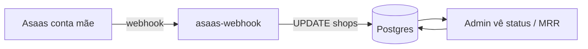
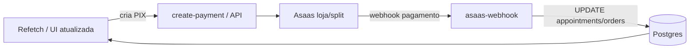

# Fluxo Asaas → webhook → banco → app

Visão geral de como o sistema reage aos eventos do Asaas após as mudanças de mensalidade da plataforma e webhook.

## Actores

| Actor | Papel |
|--------|--------|
| **Asaas (conta mãe)** | Cobranças da **mensalidade da plataforma** por estabelecimento (assinatura). |
| **Asaas (conta da loja / split)** | Cobranças de **agendamento** e **pedidos** (PIX) dos clientes. |
| **Edge Function `asaas-webhook`** | Recebe webhooks, idempotência, atualiza BD. |
| **Supabase (Postgres)** | `shops`, `appointments`, `orders`, tabelas de dedupe de webhook. |
| **Admin (portal)** | Edita `asaas_platform_subscription_id`, mensalidade, split, etc. |
| **Cliente (ShopDetails)** | Paga PIX; estado reflete após confirmação via webhook. |

## Fluxo A — Mensalidade da plataforma (assinatura na conta mãe)

1. No **Admin**, cola-se o **ID da assinatura** Asaas da conta mãe no campo da loja (`asaas_platform_subscription_id`).
2. O Asaas envia eventos para a URL da função **`asaas-webhook`** (configurada no painel Asaas).
3. A função:
   - regista eventos sensíveis em tabelas de **receipt** (evita processar duas vezes o mesmo evento);
   - em eventos de **inativação/remoção** de assinatura, marca `shops.subscription_active = false` onde o ID bate com o guardado;
   - em **pagamento recebido/confirmado**, pode consultar o pagamento na API Asaas (se houver chave) e, se o pagamento estiver ligado à assinatura certa, marca `subscription_active = true` na loja correspondente.
4. **Quem vê o quê:** métricas e lista no **Admin** (ex.: assinaturas ativas, MRR estimado) passam a refletir melhor o estado real quando o webhook e o ID estão corretos.

## Fluxo B — Pagamento de cliente (agendamento ou loja)

1. Cliente inicia pagamento; a app chama a API de criação de pagamento (ex. Edge Function `create-payment` ou fluxo equivalente).
2. Asaas gera cobrança PIX; o cliente paga.
3. Webhook **`PAYMENT_RECEIVED` / `PAYMENT_CONFIRMED`** chega em **`asaas-webhook`**.
4. A função deduplica, identifica o pagamento (ex. `externalReference`, `asaas_payment_id`) e marca **`appointments`** ou **`orders`** como pagos, conforme a lógica já existente.
5. **`PAYMENT_DELETED`**: cobrança apagada no Asaas → para linhas ainda **`PENDING`**, limpa `asaas_payment_id` e `payment_idempotency_key` (agendamento ou pedido), para o cliente poder gerar um novo PIX. Resposta sempre **200** para não penalizar a fila de webhooks.
5. **Cliente:** em `ShopDetails`, o fluxo é **PIX pendente** → link → “já paguei” / refetch; não há overlay de sucesso “fantasma” — o que importa é confirmação e estado na BD.

## Configuração mínima para funcionar bem

- URL do webhook no Asaas apontando para a função deployada.
- Secrets na função: credenciais Supabase (service role), e **`ASAAS_API_KEY`** (conta mãe) quando quiseres reconciliação rica a partir do GET do pagamento.
- **Admin:** preencher o **ID da assinatura** da plataforma por loja quando a assinatura existir no Asaas mãe.
- **Token do webhook:** no Asaas (Integrações → Webhooks), define o **token de autenticação**; o Asaas envia-o no header **`asaas-access-token`**. O mesmo valor deve estar no secret **`ASAAS_WEBHOOK_TOKEN`** da Edge Function.

## Troubleshooting: `POST | 401` nas Invocations

Dois cenários distintos:

1. **401 na gateway (antes do teu código)** — o Asaas **não envia** JWT do Supabase. A função **tem** de estar deployada com **`verify_jwt` desligado**. No repo: `supabase/config.toml` já tem `[functions.asaas-webhook] verify_jwt = false`. No deploy, usa sempre:
   `npx supabase functions deploy asaas-webhook --no-verify-jwt`
   (ou o script `npm run supabase:deploy-asaas-webhook`). No Dashboard, confirma que a função **não** exige JWT para invocação pública.
2. **401 devolvido pela função** — corpo JSON com *Missing or invalid asaas-access-token*: o Asaas **só envia** o header `asaas-access-token` se o webhook tiver **token de autenticação** configurado. O valor tem de ser **idêntico** ao secret **`ASAAS_WEBHOOK_TOKEN`** no Supabase (Project Settings → Edge Functions → Secrets). Passos: Asaas → menu do utilizador → **Integrações** → **Webhooks** → editar `webhook-barbearia` → campo de token (ou **Gerar token**) → copiar o mesmo valor para o secret no Supabase → **redeploy não é obrigatório** só por mudar o secret, mas confirma que o secret foi guardado. Depois, reativa a fila de sincronização no Asaas se estiver pausada/penalizada.

## Resumo

- **Uma função** (`asaas-webhook`) trata **dois mundos**: cobranças de **cliente** (pedidos/agenda) e **mensalidade da plataforma** (por `asaas_platform_subscription_id`).
- **Admin** liga cada loja ao ID da assinatura na conta mãe; o **webhook** mantém `subscription_active` alinhado com o Asaas quando os eventos e chaves estão certos.
